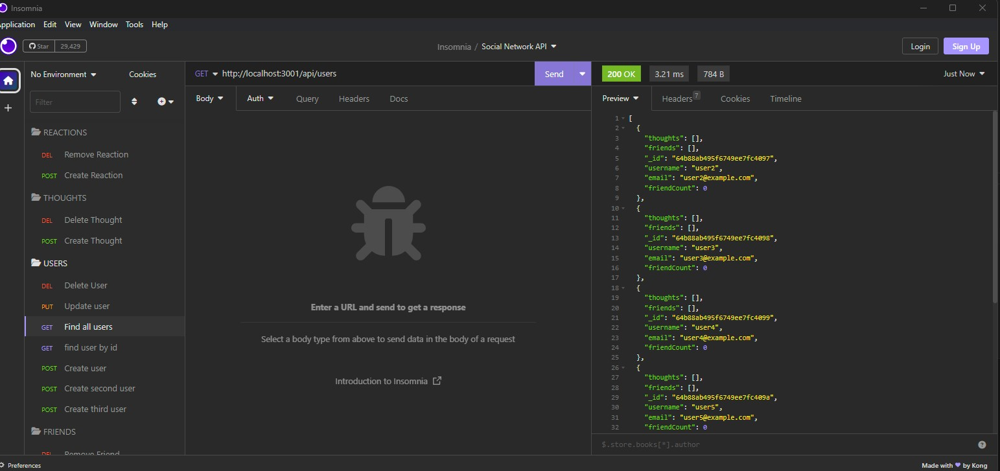

# Social-Network-API

## Description
A backend API for a social network web application where users can share their thoughts, react to friends’ thoughts, and create a friend list. This project utilizes Express.js for routing, a MongoDB database, and the Mongoose ODM.
## Table of Contents
- [Installation](#installation)
- [Usage](#usage)
- [License](#license)
- [Badges](#badges)
- [Tests](#tests)
- [Questions](#questions)

## Installation
To use this project, you will need to first install dependencies. You can do this by using the following command in the terminal:   `$ npm i` 

## Usage
To start the server, use the following command in the terminal: npm start

    

## Credits

## License
MIT License

## Badges

## Tests
N/A 

## Questions
GitHub Profile: [https://github.com/Daniel-Covington/Social_Network_API](https://github.com/Daniel-Covington/Social_Network_API) 
Video Demo : [https://drive.google.com/file/d/1voDe8iLAeHTJ_Sm_QSTUDpDogYHo1z9_/view](https://drive.google.com/file/d/1voDe8iLAeHTJ_Sm_QSTUDpDogYHo1z9_/view) 
For further questions, you can reach me at danielmcovington@gmail.com

